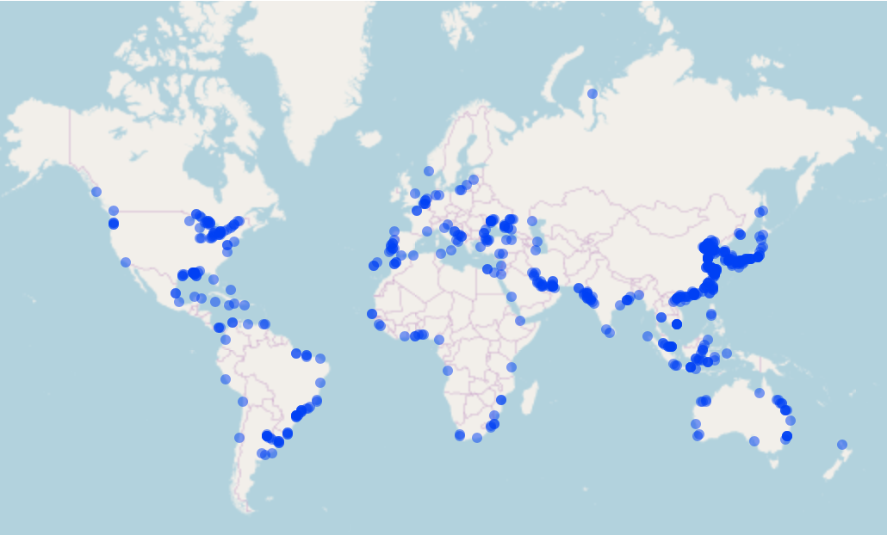
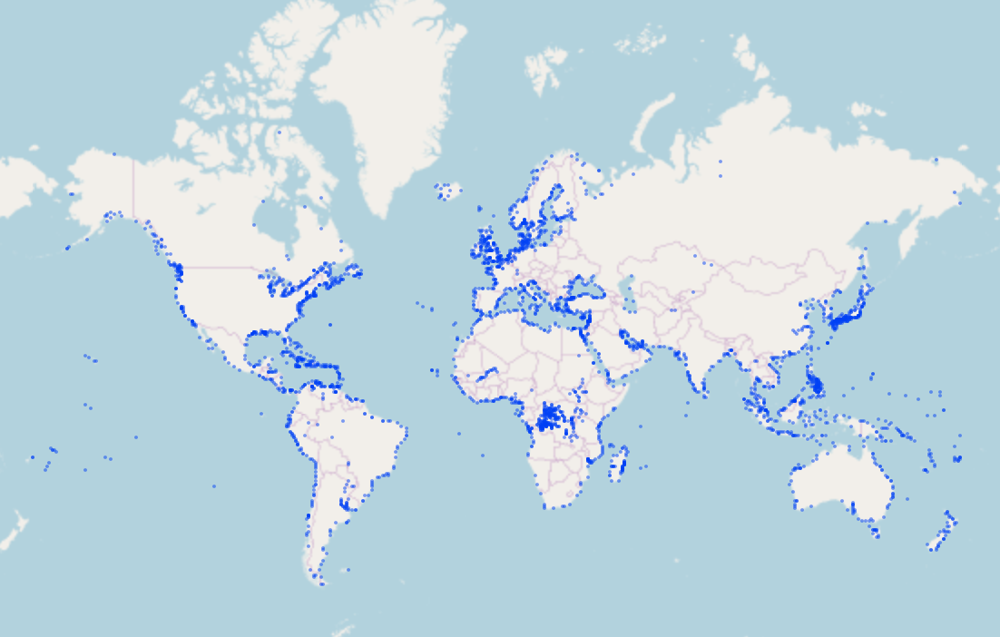
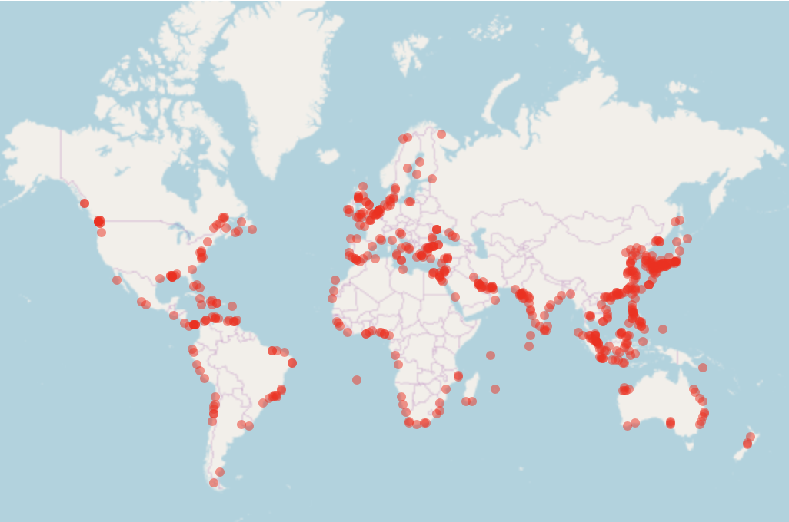
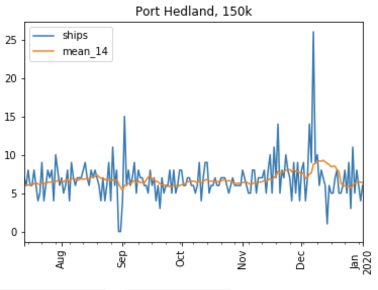
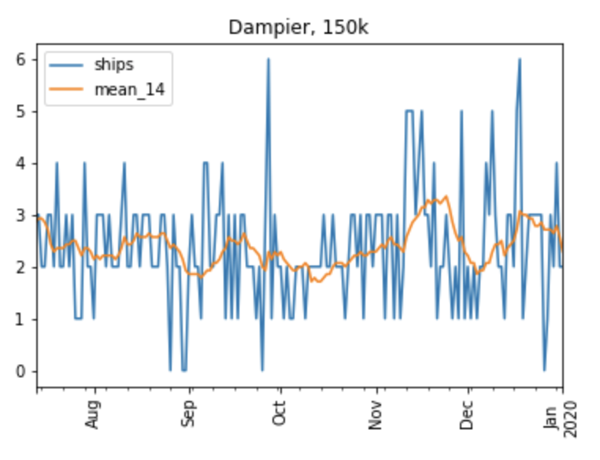
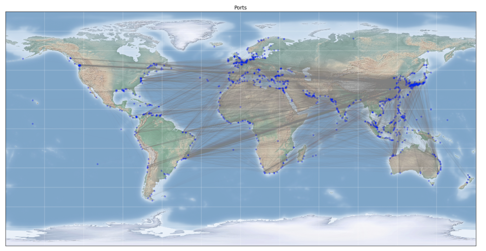
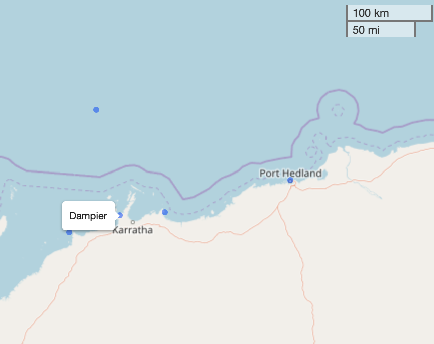

# Predicting Ship Loading at Port 

Due to unfamiliarity with AWS, most of the processing was done using compute on Kaggle.  

## Preprocessing

 Place AWS credentials in ./src/utils/ and run 

~~~
$ sh ./bin/preprocess.sh
~~~

Processing is done using pandas. In order to limit memory usage, data is read and processed by
chunks, this is possible provided processing is done by key and the data is already sorted by same key before hand. 

* **get_data** runs queries on Athena, split by _lrimoshipno_ and ordered by _lrimoshipno_ and _movementdatetime_
* **get_ports** determines port locations. A ship's average speed is calculated and if it is below a certain speed 
(default 0.1 km/h) for a certain amount of time (default 24h), 
it is considered to be in a vicinity of a port 
* **join_ports** combines the outputs of **get_ports** and eliminates duplicates within a certain distance (default 10 km)
* **dbscan_ports** uses clustering as an alternative to eliminating 'duplicate' ports within a certain distance
* **get_endpoints** determines the journey of each ship when it leaves port A and arrives at port B

Based on the analysis, we obtain some 603 ports. Some ports do not appear, this is most obvious around Europe

Data from [WFPGeoNode](https://geonode.wfp.org/layers/geonode:wld_trs_ports_wfp) has more than 3000 ports available. 
It is preferable to use this external data source as port locations instead. 

## Modelling 

Unfortunately, insufficient time was spent on modelling so there are more ideas than code.

~~~
$ sh ./bin/model.sh
~~~

* **features** determines the nearest WFPGeoNode port for each itinerary (departure and arrival)
* **graph** plots the graph of port connections. (Further work : graph and geographical clustering)
*
* 

Based on the pre-processing :
* All ships : 144k trajectories, 13634 ships and 2800 ports
* Ships with dwt >= 150k : 144k trajectories, 1645 ships and 

Location of ports visited by ships with dwt above 150k:

### Time Series

Since the endpoint data is aggregated and since the prediction period is relatively 
long (14 days), it is tempting to just use time series data to predict the number of ships loading. 

Assuming the pre-processing is correct, this are samples of how arrivals at ports vary over time: 

  
   

if we naively use the 14 day average on 1st Jan 2020 to predict the number of arrivals for 2-15 Jan, we would get an accuracy
of 48% and 91% respectively for Dampier and Port Hedland. Any evaluation of the metric would obviously have to be done over a period of time, 
preferably covering know fluctuations and spikes.

While the moving average gives a certain approximation, large spikes or dips would be missed. Pure time series methods
do not seem to be of use here to deal with the fluctuations in arrivals, unless we know of certain causal event before hand 
that could impact arrivals (e.g : blockade, accident, etc.) 

### Combining Graphs and Ship Movement Data  

#### Graphs 

We construct a directed graph with ports as nodes and ship trajectories ( above 150k dwt) as edges 
( it is better to use travelled distance instead of straight line distance). 

We are able to see the links between East Asia and Brazilian, South African and Australian ports. Using graph clustering methods 
like the Louvain or Leiden algorithms, we can cluster ports based on how ships travelling between them. 

Within this graph community cluster, it would be possible to further cluster the ports geographically with algorithms like 
k-means or DBScan. We can then obtain a 2 level hierarchical clustering based on ship itineraries and port locations. Thus, 
knowing which port a ship departed from, it is possible to get a list of ports it is likely to visit. Used alone, it only relies on the
last port visited and would provide many possible ports. 

#### Ship Movement Data 

When used alone, ship movement data (location, speed, heading, etc.) can give us more granularity. However the relatively long 
forecast period increases uncertainty; 
a ship could head to port A, then port B and then possibly port C within that time frame. 

Some ports are also located close to each other, so a ship could be headed to any one of them like Port Hedland and Dampier.

  

#### Combining the information

We could plot historical ship movement data arcs for each of the hierarchical clusters that we created to create a probability density functions.
Based on the port of departure and known travel times between the ports in the cluster, we can narrow down the list of ports that determine which geographical cluster of ports
the ship is likeliest to visit based on it's last known position, speed and heading. 

This would require that the pre-processing be revisited and the data size will increase. 

### Neural Networks 

Deep neural networks could potentially learn the information that we are trying to synthesize by using graphs and ship movement data. 
Of particular interest are CNN and Transformer architectures which performed well on a recent [CPU only Kaggle competition](https://www.kaggle.com/c/nfl-big-data-bowl-2020/overview)
where initial player position, speed and other data was used to predict outcome of NFL run plays. 

This solution could reduce memory load as the training would be done over epochs. 

## Dockerized solution 

Not done 